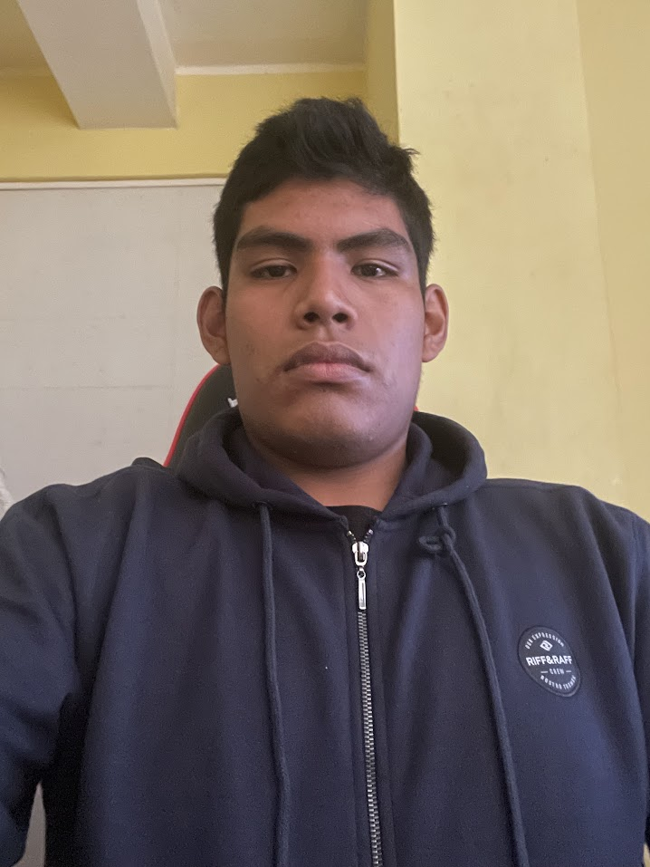

# Capítulo I: Introducción

En esta sección describimos el perfil de nuestra Startup.

## 1.1. Startup Profile

### 1.1.1. Descripción de la Startup
**Corebyte** es una startup tecnológica enfocada en el desarrollo de soluciones digitales para la industria vitivinícola. Nuestro principal objetivo es ofrecer herramientas innovadoras que permitan mejorar la trazabilidad en los procesos de producción de vinos, garantizando transparencia, control y eficiencia. A través de una aplicación web intuitiva, permitimos a productores, distribuidores y consumidores acceder a información detallada y verificable sobre cada etapa del proceso de elaboración del vino.

- *Misión*: Brindar soluciones digitales inteligentes que optimicen la trazabilidad y gestión de procesos en la industria vitivinícola, promoviendo la calidad, sostenibilidad y confianza en toda la cadena de valor del vino.

- *Visión*: Ser la plataforma líder en transformación digital para la industria vitivinícola en América Latina, reconocida por su innovación, confiabilidad y contribución al desarrollo tecnológico del sector agroindustrial.

### 1.1.2. Perfiles de integrantes del equipo

<table style="text-align:center; width:100%; border-collapse:collapse;" border="1">
    <thead style="background-color:#f2f2f2;">
        <tr>
            <th>Integrantes</th>
            <th>Descripción</th>
            <th>Conocimientos</th>
        </tr>
    </thead>
    <tbody>
        <tr>
            <!-- DATOS del integrante 1 -->
            <td>
                 
                <strong>Renzo Miguel Llerena Delagado</strong> 
                U202312399
            </td>
            <td>
                Me destaco por ser responsable, trabajador y tener un enfoque en la perfección y la calidad en todos mis proyectos. Disfruto trabajando en equipo, colaborando para alcanzar mis objetivos y siempre buscando superar expectativas. Me mantengo en constante aprendizaje, dispuesto a enfrentar desafíos con una actitud proactiva y resolutiva.
            </td>
            <td>
                Tengo conocimientos en C++, Python, Java, JavaScript, C#, PHP, Hacking ético y HTML.
            </td>
        </tr>
        <tr>
            <!-- DATOS del integrante 2 -->
            <td>
                 
                <strong>Renzo Alonso Villafuerte Tapia</strong> 
                U202310670
            </td>
            <td>
                Estudio la carrera de Ingeniería de Software en la UPC. Estoy dispuesto a apoyar a mi equipo en cualquier necesidad técnica, ofreciendo soluciones y compartiendo conocimiento.
            </td>
            <td>
                Tengo amplio conocimiento en programación en C++, incluyendo manejo de estructuras de datos, y programación orientada a objetos. Además, tengo habilidades para analizar y resolver problemas complejos de manera eficiente, gestionar tareas y proyectos asegurando el cumplimiento de plazos, y adaptarme rápidamente a nuevas tecnologías y entornos de trabajo.
            </td>
        </tr>
        <tr>
            <!-- DATOS del integrante 3 -->
            <td>
                 
                <strong>Oscar Javier Armas Sánchez</strong> 
                U20211G192
            </td>
            <td>
                Soy estudiante de la carrera de Ingeniería de Software en la UPC. Tengo pasión por la lectura, y me gusta experimentar diferentes campos. Trato siempre de poder mejorar y aprender cada día.
            </td>
            <td>
                Cuento con conocimientos en lenguajes de programación como C++, Python, programación web utilizando HTML y CSS, conocimientos en SQL; así mismo también poseo conocimientos generales en diversas materias como matemáticas y física.
            </td>
        </tr>
        <tr>
            <!-- DATOS del integrante 4 -->
            <td>
                 
                <strong>Torres Apolinario, Giovany Smith</strong> 
                U202311601
            </td>
            <td>
                Estoy cursando el quinto ciclo de mi carrera. Soy una persona responsable que le gusta resolver desafíos junto con el trabajo en equipo. Tengo la capacidad de liderazgo y me gusta aprender nuevas cosas día a día.
            </td>
            <td>
                Cuento con conocimientos en lenguajes de programación como C++, Python, programación web utilizando HTML y CSS, conocimientos en SQL; así mismo también poseo conocimientos generales en diversas materias como matemáticas y física.
            </td>
        </tr>
        <tr>
            <!-- DATOS del integrante 5 -->
            <td>
                 
                <strong>Matias Sebastian Diaz Quispe</strong> 
                U202311938
            </td>
            <td>
                Soy estudiante de la carrera de Ingeniería de Software en la UPC. Me encanta la carrera que estoy estudiando y es por ello que estoy dispuesto a dar todo por mi equipo y el curso.
            </td>
            <td>
                Tengo conocimientos en los lenguajes C++, Python básico, JavaScript, HTML y CSS, programación orientada a objetos, además de contar con manejo básico de frameworks como Angular y React. Soy adaptable y tengo una fuerte ética de trabajo.
            </td>
        </tr>
    </tbody>
</table>

## 1.2. Solution Profile

### 1.2.1. Antecedentes y problemática

#### Antecedentes
La industria vitivinícola, especialmente en Latinoamérica, ha experimentado un crecimiento importante en la última década. Sin embargo, muchas bodegas y pequeños productores aún operan con métodos tradicionales que dificultan el seguimiento del proceso de elaboración del vino. La trazabilidad es una exigencia creciente del mercado, tanto para la exportación como para satisfacer las expectativas de consumidores conscientes.

#### Problemáticas
- Dificultad para registrar y acceder a la información de producción en tiempo real.
- Escasa digitalización en pequeños y medianos viñedos.
- Ausencia de transparencia en la cadena de suministro.
- Pérdida de confianza del consumidor ante productos sin respaldo documental.

#### Técnica de las 5 ‘W’s y 2 ‘H’s

##### What?
- *¿Cuál es el problema?*  
  Falta de trazabilidad eficiente y digitalizada en la producción de vinos.

- *¿Cuál es la relación con la persona en cuestión?*  
  Productores y distribuidores necesitan registrar información y generar confianza en sus clientes; los consumidores quieren saber el origen y la calidad del vino que consumen.

##### When?
- *¿Cuándo sucede el problema?*  
  Durante todo el ciclo de producción del vino: cosecha, fermentación, embotellado y distribución.

- *¿Cuándo utiliza el cliente el producto?*  
  El productor lo utiliza durante la elaboración del vino. El consumidor lo accede al momento de adquirir el producto, escaneando un código QR, por ejemplo.

##### Where?
- *¿Dónde está el cliente cuando usa el producto?*  
  El productor, en la bodega o viñedo; el consumidor, en tiendas, supermercados o desde su casa.

- *¿A dónde se dirige?*  
  El productor hacia una gestión más eficiente y certificable; el consumidor hacia una compra informada.

- *¿Dónde surge el problema?*  
  En la falta de herramientas que conecten todas las etapas del proceso con registros digitales confiables.

##### Who?
- *¿Quiénes están involucrados?*  
  Productores de vino, distribuidores, consumidores, certificadoras, organismos reguladores.

##### Why?
- *¿Cuál es la causa del problema?*  
  Falta de digitalización, desconocimiento tecnológico, y ausencia de soluciones accesibles para trazabilidad.

##### How?
- *¿En qué condiciones los clientes usan nuestros productos?*  
  En ambientes de producción agrícola e industrial, con conexión a internet básica y dispositivos móviles o PC.

- *¿Cómo prefieren los clientes acceder a nuestro producto?*  
  A través de una interfaz web responsiva con módulos claros y acceso rápido a reportes.

- *¿Qué llevó al cliente a llegar a esta situación?*  
  El crecimiento del mercado, la necesidad de certificación y la demanda por transparencia de parte de los consumidores.

##### How much?
- *¿Cuántos problemas se dan en un día? ¿En una semana? ¿En un mes? ¿Cuánto dinero están implicando?*  
  Se pueden presentar múltiples errores de registro o pérdida de datos cada semana, lo que puede generar pérdidas de hasta cientos o miles de soles por lote, especialmente en producción a mediana escala.

### 1.2.2. Lean UX Process

#### 1.2.2.1. Lean UX Problem Statements
- *Plantilla Business Opportunity Statement:*  
  Nuestro cliente es un productor de vino que necesita digitalizar y asegurar la trazabilidad de sus procesos de producción, porque actualmente usa métodos manuales que son ineficientes y poco confiables. El éxito se medirá por la cantidad de productores que implementen nuestra solución y logren certificarse o mejorar sus ventas.

- *ReStyle Lean UX Problem Statements:*  
  Creemos que los productores de vino necesitan una plataforma digital para registrar y validar sus procesos porque actualmente operan con herramientas limitadas o analógicas.

#### 1.2.2.2. Lean UX Assumptions

- *Users:* Productores de vino, distribuidores, enólogos, consumidores.

- *User Outcomes:*
  - Mayor confianza del consumidor.
  - Mejora en procesos de calidad y certificación.
  - Trazabilidad validada y fácilmente compartible.

- *Suposiciones de negocio:*
  - El mercado vitivinícola está dispuesto a invertir en digitalización.
  - La trazabilidad será un diferenciador comercial.

- *Suposiciones de usuario:*
  - *¿Quién utiliza nuestra plataforma?* Productores, enólogos, distribuidores.
  - *¿Cómo se integra nuestro producto en la rutina laboral o cotidiana?* A través del registro diario de etapas de producción y monitoreo desde dispositivos móviles o PC.
  - *¿Cuáles son los desafíos que aborda nuestro producto?* Falta de trazabilidad, errores de registro manual, desconfianza del cliente final.
  - *¿Cuál es la imagen que deseamos proyectar con nuestro producto?* Profesionalismo, eficiencia, confianza y modernidad.
  - *¿Cuál es el propósito fundamental de nuestra aplicación?* Digitalizar y transparentar el proceso de producción del vino.
  - *¿Qué funcionalidades destacan en nuestra aplicación?* Registro por etapas, generación de reportes, acceso a historial por lote, escaneo QR para consumidores.

#### 1.2.2.3. Lean UX Hypothesis Statements

- *Hipótesis 1:* Si ofrecemos una plataforma sencilla de usar, los productores podrán digitalizar sus procesos sin barreras técnicas.
- *Hipótesis 2:* Si los consumidores pueden escanear un código QR y ver el historial del vino, aumentará su confianza y fidelización.
- *Hipótesis 3:* Si las certificadoras acceden fácilmente a la información digital, los procesos de auditoría serán más rápidos.
- *Hipótesis 4:* Si se integran reportes automáticos por lote, los productores reducirán errores y mejorarán la trazabilidad.
- *Hipótesis 5:* Si logramos integrarnos con herramientas que ya usan los productores, la adopción de la plataforma será más rápida.

#### 1.2.2.4. Lean UX Canvas
(Se desarrollará posteriormente como una herramienta visual que organice usuarios, problemas, soluciones y métricas en un solo esquema)

## 1.3. Segmentos objetivo

La solución desarrollada por *Corebyte* está dirigida a diferentes actores clave dentro del proceso de elaboración y comercialización del vino. A continuación, se detallan los principales segmentos objetivo:

### 1. Productores de vino (bodegas y viñedos)
- *Perfil:* Empresas dedicadas a la producción de vino artesanal o industrial.
- *Ubicación:* Principalmente en regiones vitivinícolas del Perú y Latinoamérica.
- *Necesidad:* Requieren un sistema eficiente para registrar, supervisar y validar cada etapa del proceso de producción del vino.

### 2. Distribuidores y exportadores de vino
- *Perfil:* Empresas encargadas de la comercialización y exportación de vinos.
- *Necesidad:* Acceder a información confiable sobre la trazabilidad del vino para garantizar su origen y calidad.

### 3. Organismos reguladores y certificadores
- *Perfil:* Entidades que supervisan el cumplimiento de normas de calidad y certificación.
- *Necesidad:* Validar los procesos de producción mediante datos verificables.

### 4. Consumidores finales interesados en el origen del vino
- *Perfil:* Personas que buscan conocer el proceso de elaboración del vino que consumen.
- *Necesidad:* Obtener información clara y verificada sobre la procedencia del vino.

### 5. Enólogos y técnicos vitivinícolas
- *Perfil:* Profesionales responsables del control técnico de calidad en la producción del vino.
- *Necesidad:* Registrar condiciones específicas y acceder a datos históricos para optimizar procesos.

